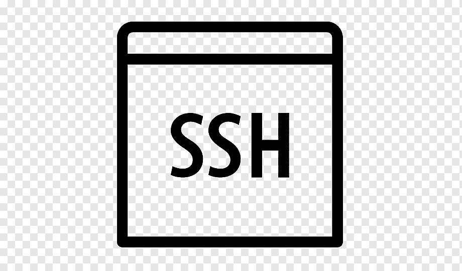

<!-- PROJECT SHIELDS -->
<!--
*** I'm using markdown "reference style" links for readability.
*** Reference links are enclosed in brackets [ ] instead of parentheses ( ).
*** See the bottom of this document for the declaration of the reference variables
*** for contributors-url, forks-url, etc. This is an optional, concise syntax you may use.
*** https://www.markdownguide.org/basic-syntax/#reference-style-links
-->

<!-- PROJECT LOGO -->
<br />
<p align="center">
  <a href="https://github.com/othneildrew/Best-README-Template">
    
  </a>
  <h3 align="center">SSH Config Bastion</h3>

  <p align="center">
    This projects helps users set up a connection to a resource behind a bastion server. This is especially useful when trying to connect to a database via localhost using port-forwarding through the bastion server.
    <br />
    <a href="https://github.com/jasoncorneliog/ssh-config-bastion"><strong>Explore the docs »</strong></a>
    <br />
    <br />
    <a href="https://github.com/jasoncorneliog/ssh-config-bastion/issues">Report Bug</a>
    ·
    <a href="https://github.com/jasoncorneliog/ssh-config-bastion/issues">Request Feature</a>
  </p>
</p>

<!-- TABLE OF CONTENTS -->

## Table of Contents

- [About the Project](#about-the-project)
  - [Built With](#built-with)
- [Getting Started](#getting-started)
  - [Prerequisites](#prerequisites)
  - [Installation](#installation)
- [Usage](#usage)
- [Roadmap](#roadmap)
- [Contributing](#contributing)
- [License](#license)
- [Contact](#contact)
- [Acknowledgements](#acknowledgements)

<!-- ABOUT THE PROJECT -->

## About The Project

### Built With

- [Shell](https://www.gnu.org/software/bash/)

<!-- GETTING STARTED -->

## Getting Started

To get a local copy up and running follow these simple steps.

### Prerequisites

This is an example of how to list things you need to use the software and how to install them.

- If you're accessing a bastion server, ensure that your IPV4 address is whitelisted by the server.
- If you're using this to connect to a database, make sure you install the respective database client on your computer.

### Installation

1. Clone the repo

```sh
git clone https://github.com/jasoncorneliog/ssh-config-bastion.git
```

2. Rename your .pem key to secret.pem, and Place the secret.pem key under the /Port_Forwarding folder.

3. Configure the /Port_Forwarding/ssh_config file by editing the following fields. You can CTRL + F the following and replace it with your respective variables. If you changed the database name, change it in the port_forward.sh file too.

```
database - Change it to your preferred alias of the database.
bastion_ip - Change this to the IP of the bastion server.
user_name - Change this to your default username.
secret.pem - Rename this to the filename discussed in step 2.
db_port - Port of the database.
database_host.amazonaws.com - The name of the database you're trying to connect to.
```

<!-- USAGE EXAMPLES -->

## Usage

Run the shell script within the /Port_Forwarding folder to update ssh-config.

```
cd Port_Forwarding
sh port_forward.sh
```

<!-- ROADMAP -->

## Roadmap

See the [open issues](https://github.com/jasoncorneliog/ssh-config-bastion/issues) for a list of proposed features (and known issues).

<!-- CONTRIBUTING -->

## Contributing

Contributions are what make the open source community such an amazing place to be learn, inspire, and create. Any contributions you make are **greatly appreciated**.

1. Fork the Project
2. Create your Feature Branch (`git checkout -b feature/AmazingFeature`)
3. Commit your Changes (`git commit -m 'Add some AmazingFeature'`)
4. Push to the Branch (`git push origin feature/AmazingFeature`)
5. Open a Pull Request

<!-- LICENSE -->

## License

Distributed under the Apache 2.0 License. See `LICENSE` for more information.

<!-- CONTACT -->

## Contact

Jason Cornelio - [LinkedIn](https://www.linkedin.com/in/jasoncornelio)

Project Link: [https://github.com/jasoncorneliog/ssh-config-bastion](https://github.com/jasoncorneliog/ssh-config-bastion)
